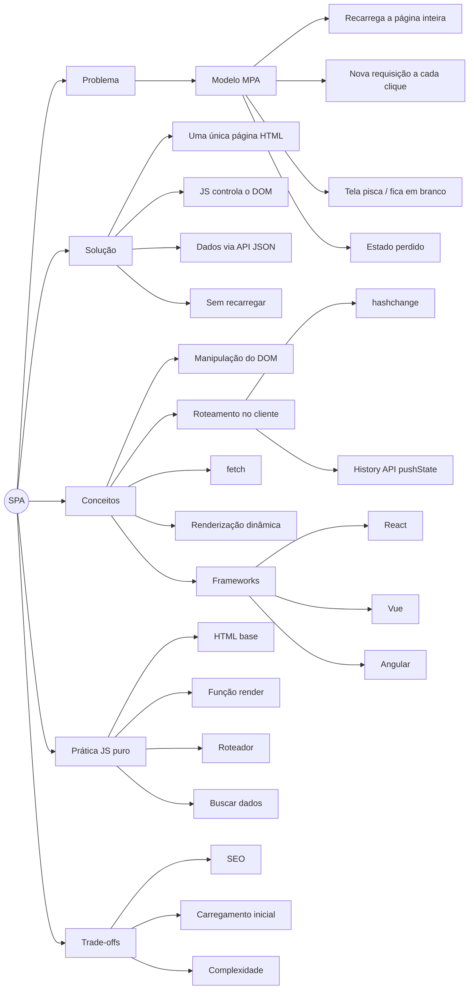

# Single Page Application (SPA)

[Exemplo completo - Z-Scouter](https://anderitmo.github.io/spa-fatec-atibaia/SPA-DragonBall/)

> Resumo da aula — material de apoio para revisão e estudo.

---

## Mapa Mental



> **Nota:** o diagrama usa Mermaid (`graph`), com todas as conexões declaradas explicitamente — assim nenhum nó fica solto. No Obsidian costuma renderizar nativamente; no Notion, cole dentro de um bloco de código com a linguagem `mermaid`. Caso não renderize na sua configuração, o conteúdo continua legível como texto.

---

## 1. O Problema: o modelo tradicional (MPA)

Antes das SPAs, a web funcionava (e em muitos casos ainda funciona) com o modelo **MPA — Multi-Page Application**.

**Como funciona o MPA:**

1. O usuário clica em um link.
2. O navegador faz uma **nova requisição HTTP** ao servidor.
3. O servidor monta e devolve um **documento HTML completo**.
4. O navegador **descarta a página atual** e renderiza a nova do zero.

**Limitações desse modelo:**

- **Recarregamento total a cada navegação** — a tela "pisca" e fica em branco por um instante.
- **Reprocessamento de recursos** — CSS, JS e estrutura são reavaliados a cada página, mesmo quando são praticamente os mesmos.
- **Mais tráfego de rede** — trafega-se o HTML inteiro repetidamente, não apenas o que mudou.
- **Perda de estado** — variáveis em memória, posição de rolagem e estado da interface se perdem entre páginas.
- **Experiência menos fluida** — a navegação parece "quebrada" em etapas, diferente de um aplicativo.

> *Inferência:* essas limitações não impedem o MPA de ser uma boa escolha em muitos cenários (sites de conteúdo, blogs, e-commerce com forte necessidade de SEO). O problema é específico de aplicações altamente interativas.

---

## 2. A Solução: Single Page Application

Uma **SPA** carrega **uma única página HTML inicial**. A partir daí, o **JavaScript assume o controle** e atualiza apenas as partes necessárias da tela, sem recarregar tudo.

**Como funciona:**

1. O servidor envia **uma vez** o HTML base + o JavaScript da aplicação.
2. Quando o usuário interage (clica, navega, envia formulário), o **JS intercepta** a ação.
3. Se precisar de dados, o JS busca **apenas os dados** no servidor — normalmente em **JSON**, via `fetch` — sem recarregar a página.
4. O JS **atualiza o DOM** dinamicamente, trocando só o trecho que mudou.

O resultado é uma navegação **fluida**, parecida com a de um aplicativo de desktop ou celular: sem o "piscar" da tela, preservando estado e transferindo menos dados.

---

## 3. Exemplos

Aplicações conhecidas que se comportam como SPA (a navegação interna acontece sem recarregar a página):

- **Gmail** — trocar de pasta, abrir um e-mail, arquivar: a tela não recarrega.
- **Google Maps** — arrastar o mapa e buscar locais sem recarregamento.
- **Trello** — mover cartões entre colunas instantaneamente.
- **Spotify (web player)** — navegar entre álbuns enquanto a música continua tocando.

> *Inferência:* classifico esses produtos como SPA com base no **comportamento observável** (navegação sem recarregar). Não tenho como confirmar os detalhes internos da arquitetura atual de cada um — empresas mudam suas implementações ao longo do tempo. Use-os como ilustração do conceito, não como descrição técnica verificada.

---

## 4. Conceitos Centrais

| Conceito | O que é |
|----------|---------|
| **Manipulação do DOM** | Alterar a página via JavaScript (criar, remover, atualizar elementos) sem recarregar. |
| **Roteamento no cliente** | Decidir *no navegador* qual "tela" mostrar conforme a URL, sem pedir uma nova página ao servidor. |
| **`fetch` / API** | Buscar dados do servidor (geralmente JSON) de forma assíncrona. |
| **Renderização dinâmica** | Gerar o HTML da tela a partir desses dados, em tempo de execução. |
| **Estado** | Os dados que a aplicação mantém em memória (usuário logado, lista carregada, etc.). |
| **Frameworks** | React, Vue e Angular automatizam roteamento, renderização e gestão de estado. Não são obrigatórios — dá para fazer SPA com JS puro. |

---

## 5. Roteamento no cliente

O **roteador** é o que faz a SPA mostrar telas diferentes conforme a URL — **sem** pedir uma nova página ao servidor. Existem duas abordagens principais.

### 5.1. `hashchange` (apenas para conhecer)

Usa o trecho da URL após o `#` (ex.: `site.com/#/sobre`). O navegador **não** envia o que vem depois do `#` ao servidor, e o evento `hashchange` avisa quando ele muda.

```js
window.addEventListener("hashchange", () => {
  console.log("Rota atual:", location.hash); // ex.: "#/sobre"
});
```

**Por que existe:** foi a forma clássica de roteamento em SPAs, é simples e funciona em navegadores antigos sem configuração no servidor.
**Por que vamos além dele:** as URLs ficam com `#`, o que é menos elegante. Hoje a abordagem mais comum é a **History API**, que veremos a seguir.

### 5.2. History API com `pushState` (o foco)

A **History API** permite **mudar a URL e o histórico do navegador sem recarregar a página**, gerando URLs "limpas" (ex.: `site.com/sobre`, sem `#`).

**As três peças que você precisa conhecer:**

```js
// 1. Muda a URL e adiciona uma entrada no histórico — SEM recarregar
history.pushState({ pagina: "sobre" }, "", "/sobre");

// 2. Dispara quando o usuário usa os botões Voltar/Avançar do navegador
window.addEventListener("popstate", (evento) => {
  console.log("Estado da rota:", evento.state);
  renderizar(); // redesenha a tela conforme a nova URL
});
```

- `pushState(state, title, url)` — `state` é um objeto que você guarda junto com a entrada; `title` costuma ser ignorado (passe `""`); `url` é a nova URL exibida.
- `popstate` — essencial: sem ele, os botões **Voltar/Avançar** não funcionariam na sua SPA.

> *Observação importante:* `pushState` muda a URL **dentro** da aplicação. Mas se o usuário **digitar** `site.com/sobre` direto ou recarregar (F5), o navegador pedirá `/sobre` ao **servidor**. Por isso, uma SPA real com History API geralmente precisa que **o servidor seja configurado para devolver o `index.html` em qualquer rota** (fallback). Isso depende de configuração de servidor, que foge do escopo de JS puro no navegador.

---

## 6. Prática: criando seu próprio SPA com JS puro

Exemplo mínimo e funcional, em três partes. *Inferência:* o código abaixo segue padrões padrão da API do navegador; não o executei neste ambiente, então recomendo testá-lo localmente antes de usar em aula.

### 6.1. HTML base

Uma única página, com um "container" que será preenchido por JavaScript.

```html
<!DOCTYPE html>
<html lang="pt-br">
<head>
  <meta charset="UTF-8">
  <title>Minha SPA</title>
</head>
<body>
  <nav>
    <a href="/" data-link>Início</a>
    <a href="/sobre" data-link>Sobre</a>
  </nav>

  <div id="app"></div> <!-- aqui o conteúdo será trocado -->

  <script src="app.js"></script>
</body>
</html>
```

### 6.2. Função de renderização e tabela de rotas

```js
const app = document.getElementById("app");

// Cada rota devolve o HTML da sua "tela"
const rotas = {
  "/":      () => "<h1>Início</h1><p>Bem-vindo!</p>",
  "/sobre": () => "<h1>Sobre</h1><p>Página sobre nós.</p>",
};

function renderizar() {
  const caminho = location.pathname;          // ex.: "/sobre"
  const tela = rotas[caminho] || (() => "<h1>404</h1>");
  app.innerHTML = tela();                      // atualiza só o #app
}
```

### 6.3. Roteador com `pushState`

Intercepta os cliques nos links e troca a tela sem recarregar.

```js
// Intercepta cliques nos links marcados com data-link
document.addEventListener("click", (e) => {
  if (e.target.matches("[data-link]")) {
    e.preventDefault();                        // impede a navegação normal
    const destino = e.target.getAttribute("href");
    history.pushState(null, "", destino);      // muda a URL, sem recarregar
    renderizar();                              // desenha a nova tela
  }
});

// Faz Voltar/Avançar funcionarem
window.addEventListener("popstate", renderizar);

// Desenha a tela inicial ao carregar
renderizar();
```

### 6.4. Buscando dados de uma API (opcional)

Para tornar a tela dinâmica, troque o HTML fixo por dados vindos de `fetch`:

```js
async function telaUsuarios() {
  const resposta = await fetch("https://exemplo.com/api/usuarios");
  const usuarios = await resposta.json();
  const itens = usuarios.map(u => `<li>${u.nome}</li>`).join("");
  app.innerHTML = `<h1>Usuários</h1><ul>${itens}</ul>`;
}
```

> A URL `https://exemplo.com/api/usuarios` é **fictícia**, apenas para ilustrar o formato. Substitua por uma API real ao testar.

---

## 7. Trade-offs (quando NÃO usar SPA)

SPA não é sempre a melhor escolha. Pontos a pesar:

- **SEO** — como o conteúdo é montado por JS, buscadores podem ter dificuldade em indexá-lo (existem soluções como SSR, mas adicionam complexidade).
- **Carregamento inicial** — o primeiro acesso baixa todo o JS da aplicação, podendo ser mais lento que uma página simples.
- **Complexidade** — roteamento, estado e renderização passam a ser responsabilidade do seu código (ou do framework).
- **JavaScript obrigatório** — sem JS habilitado, a aplicação não funciona.

> *Opinião:* para aplicações muito interativas (painéis, ferramentas, apps), o ganho de fluidez compensa. Para sites de conteúdo onde SEO e carregamento rápido são críticos, MPA ou abordagens híbridas costumam ser mais adequados.

---

## Resumo em uma frase

> Uma SPA carrega **uma página só** e usa **JavaScript** para atualizar a tela e buscar dados **sem recarregar**, trocando a navegação em "etapas" do modelo tradicional por uma experiência fluida de aplicativo — ao custo de mais complexidade e cuidados com SEO.

---

**Referências**
* 
