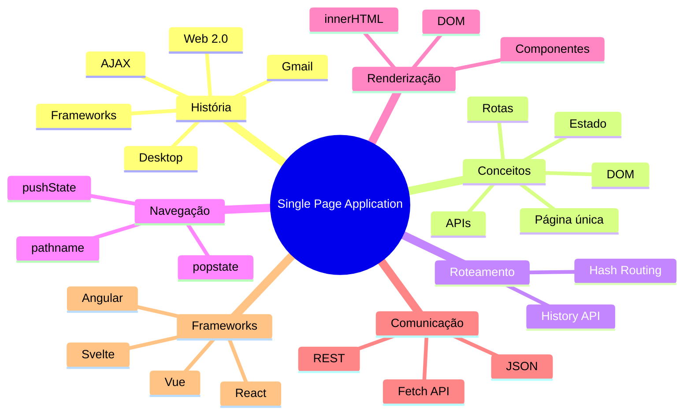

# Single Page Application (SPA) com JS Puro e Responsividade

Uma **Single Page Application (SPA)** é uma arquitetura de aplicações web em que apenas **uma única página HTML é carregada pelo navegador**. A partir desse momento, toda a navegação acontece através do JavaScript, que altera dinamicamente o conteúdo da interface sem realizar um novo carregamento da página.

> O objetivo principal de uma SPA é proporcionar uma experiência semelhante à de aplicações Desktop, reduzindo recarregamentos, preservando o estado da aplicação e tornando a navegação muito mais fluida.

---

# ▶ Exemplos funcionando

## 🐶 Pet SPA (History API)

Aplicação simples demonstrando os conceitos fundamentais de SPA.

https://anderitmo.github.io/spa-fatec-atibaia/pet-spa

---

## 🎸 Guitar Shop - MPA vs SPA (Hash Routing)

Comparação entre uma aplicação tradicional (MPA) e uma SPA utilizando **HashChange**.

https://anderitmo.github.io/spa-fatec-atibaia/exemplo-app/

---

## 🐉 Z-Scouter (History API + API REST)

SPA completa utilizando **History API** e consumindo dados da API Dragon Ball.

https://anderitmo.github.io/spa-fatec-atibaia/SPA-DragonBall/

---

# 🧠 Mapa Mental



---

# O problema das aplicações tradicionais (MPA)

Nas aplicações tradicionais (**Multi Page Applications**) cada clique do usuário gera uma nova requisição ao servidor.

```
Usuário
      │
      ▼
Servidor
      │
      ▼
Nova página HTML
```

Consequências:

- recarregamento completo da página;
- perda do estado da aplicação;
- maior consumo de processamento do servidor;
- maior tempo de resposta;
- experiência do usuário menos fluida.

---

# Como funciona uma SPA?

Em uma SPA, o HTML inicial é carregado apenas uma vez.

Depois disso, quem controla toda a navegação é o JavaScript.

```
HTML
 │
 ▼
JavaScript
 │
 ├── altera o DOM
 ├── muda a URL
 ├── consome APIs
 └── renderiza novas telas
```

A página continua sendo a mesma.

O que muda é apenas seu conteúdo.

---

# Os quatro pilares de uma SPA

## 1. Roteamento

O JavaScript decide qual conteúdo será exibido de acordo com a URL.

Exemplo do projeto:

```javascript
function rota() {

    const url = window.location.pathname;

    if (url === "/" || url === "/index.html") {

        renderizarAgenda();

    } else {

        if (url.startsWith("/agendar/")) {

            const id = url.split("/")[2];

            renderizarConfirmacao(id);

        }

    }

}
```

Observe que:

- não existe troca de página;
- apenas interpretamos a URL;
- cada rota executa uma função diferente.

---

## 2. Navegação

Em vez de abrir outro documento HTML, utilizamos a **History API**.

```javascript
function navegar(rotaPathname){

    window.history.pushState(
        null,
        null,
        rotaPathname
    );

    rota();

}
```

O método `pushState()` altera apenas a URL.

Nenhuma página é recarregada.

---

## 3. Renderização dinâmica

Depois de descobrir qual rota está ativa, renderizamos o conteúdo.

```javascript
function renderizarConfirmacao(id){

    app.innerHTML = `
        <h2>Confirmação</h2>
        <p>ID ${id}</p>
    `;

}
```

Perceba que estamos alterando apenas uma `<div>`.

O restante da aplicação permanece intacto.

---

## 4. Controle do histórico

O botão **Voltar** do navegador continua funcionando.

Isso acontece graças ao evento `popstate`.

```javascript
window.addEventListener(
    "popstate",
    rota
);
```

Sempre que o usuário volta ou avança no histórico, executamos novamente o roteador.

---

# Fluxo completo

```mermaid
flowchart LR

A[Usuário] --> B[Clica em um botão]

B --> C[pushState]

C --> D[URL muda]

D --> E[Função rota()]

E --> F[Renderização]

F --> G[DOM atualizado]
```

---

# O ciclo de vida da aplicação

Quando a aplicação inicia:

```javascript
window.addEventListener(
    "DOMContentLoaded",
    rota
);
```

1. a página é carregada;
2. o roteador é executado;
3. o conteúdo correto é renderizado.

Durante a navegação:

```
Clique

↓

pushState()

↓

rota()

↓

Renderização

↓

DOM atualizado
```

---

# Hash Routing × History API

| Hash Routing | History API |
|--------------|-------------|
| URL contém # | URL limpa |
| Baseado em hashchange | Baseado em pushState |
| Muito simples | Mais profissional |
| Não precisa configurar servidor | Pode exigir configuração do servidor |
| Compatível com GitHub Pages | Utilizado por React, Vue e Angular |

---

# Estado da Aplicação (State)

Uma SPA mantém os dados carregados na memória.

Exemplos:

- usuário autenticado;
- carrinho de compras;
- música tocando no Spotify;
- formulário parcialmente preenchido;
- filtros aplicados.

Como não ocorre recarregamento da página, todas essas informações continuam disponíveis.

---

# Comunicação assíncrona

Em vez de solicitar novas páginas HTML, uma SPA normalmente troca apenas dados.

```
SPA

↓

fetch()

↓

API REST

↓

JSON

↓

Atualização do DOM
```

É por isso que aplicações modernas enviam e recebem principalmente **JSON**, e não páginas completas.

---

# Frameworks modernos

Os principais frameworks utilizam exatamente os mesmos conceitos apresentados neste projeto.

- React
- Angular
- Vue
- Svelte

A principal diferença é que esses frameworks automatizam tarefas como:

- roteamento;
- renderização;
- gerenciamento de estado;
- componentes;
- comunicação com APIs.

---

# Conclusão

Independentemente do framework utilizado, praticamente toda SPA é construída sobre quatro conceitos fundamentais:

- Roteamento no cliente;
- Manipulação dinâmica do DOM;
- Comunicação assíncrona com APIs;
- Gerenciamento do histórico de navegação.

Os exemplos deste repositório demonstram esses conceitos utilizando apenas **HTML, CSS e JavaScript puro**, facilitando a compreensão da arquitetura antes da utilização de frameworks como React, Angular ou Vue.
